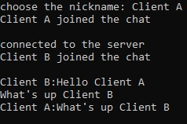

# GChat-GroupChatSystem-
GChat is a group chatting system which enables people to get connected with each other. The project is created using Python using socket use pycharm is ide 

# Introduction
Python is a great programming language for computer networking. It allows us to create solid applications very fast and easily. In this tutorial, we are going to implement a fully-functioning TCP chat. We will have one server that hosts the chat and multiple clients that connect to it and communicate with each other. At the end, you can also add custom features like chat rooms, commands, roles etc., if you want to.

# Client-Server Architecture
For our application, we will use the client-server architecture. This means that we will have multiple clients (the users) and one central server that hosts everything and provides the data for these clients.

#Running The Chat
Let’s go for a test run. Just keep in mind that we always need to start the server first because otherwise the clients can’t connect to a non-existing host. Here you can see an example of a chat with two clients:

# Server Log

# Client A Log

# Client B Log

# Client B Log after Client A leaves the chat room

